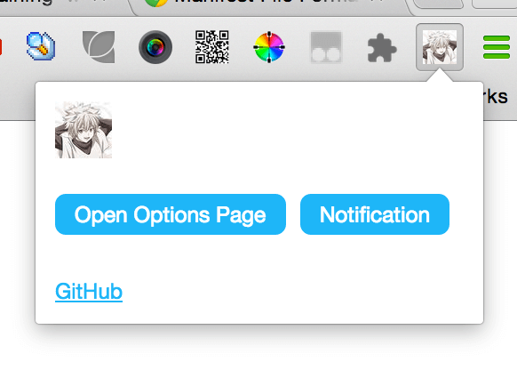

# chrome-plugin-boilerplate
Simple boilerplate for generating a Google Chrome Plugin.

## Screenshot

## Manifest

[https://developer.chrome.com/extensions/manifest](https://developer.chrome.com/extensions/manifest)